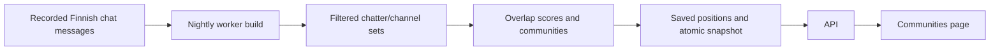

# Finnish community map

Status: implemented, 2026-09-06. The presence, category, and layout revisions (`finnish-presence-v4`) is specified in [the current runbook](runbooks/community-map.md); it supersedes the message-only input and counting rules below. The original design is retained for context. The worker, saved snapshots, public explorer, and admin build control are implemented with graph and PostgreSQL integration tests. Read-only production aggregate checks and isolated desktop/mobile checks are recorded in [the community map runbook](runbooks/community-map.md). The sections below preserve the design rationale; the runbook describes the shipped behavior and measured limits.

## Product

Add a **Communities** page at `/communities`: an interactive network of the Finnish streams already covered by Twitch Tracker. A node is a channel, a line represents people who chatted in both channels during the reporting window, and a color identifies an automatically detected community. Stronger connections draw channels closer together. Node area reflects distinct qualifying chatters, with a size cap for readability.

Start with a rolling 30-day window, rebuilt nightly. This gives occasional Finnish streamers more opportunity to appear than a single-day map. Use the site's current Finnish eligibility rules, including Finnish language, Suomi/Finnish tags, and manual pins; do not infer anyone's nationality. Describe the result as observed chat communities, not the entire Finnish Twitch audience.

[Twitchmap](https://twitchmap.com/) describes a similar approach using active chatters, normalized connections, detected communities, and a force-directed layout. It currently describes a roughly 10-day window and six-hour rebuilds. Our proposed 30-day/nightly defaults are a starting point for this smaller scene, not a requirement imposed by those examples.

## Page behavior

- Fit the existing site header and visual style. Add Communities beside Live.
- Put a large map below the title, reporting dates, and last successful update time.
- Provide channel search, pan, zoom, reset view, and a community selector.
- Selecting a channel highlights its neighbors and opens a panel with its profile link, qualifying chatter count, community, and strongest connections.
- Each connection shows shared chatter count and a clearly labeled percentage of the selected channel's qualifying chatters. The percentage changes when selecting the other endpoint; it is not the graph's symmetric connection score.
- Include a short legend: size = active chatters; lines = shared chatters; color = detected community. Position is not geographic and does not establish friendship or affiliation.
- Keep labels sparse until hover, focus, search, or selection. Use an accessible channel/connection list alongside the visualization, so color, dragging, and pointer interaction are not required.
- On mobile, put channel details below the map. Support reduced motion and render saved positions without a continuously running physics simulation.
- Channels with enough activity but no qualifying connections remain searchable as ungrouped nodes. A missing channel gets “Not enough recorded chat activity for this map.” It does not get a fabricated zero audience.
- Show the previous successful map if a scheduled build fails, with its actual timestamp. Before any successful build, show an honest unavailable state. Distinguish a successful empty result from a failed build.

Do not include historical playback, live animation, inferred community names, or raid recommendations in the first version. Name communities by representative channels, for example “Channel A / Channel B,” without inventing social or demographic labels.

## What the repository already has

| Existing area | Use and limitation |
| --- | --- |
| `packages/db/src/schema.ts`: `chat_messages` | Stable chatter/channel IDs, session ID, and timestamps. The IRC writer maps the shared-chat source tag into the existing column; migration 0012 recovers available historical tags. Source coverage still needs measurement where raw records are unavailable. |
| `chatter_channel_activity_buckets` and `apps/worker/src/loops/aggregation.ts` | Already aggregate chatter/channel activity. However, these buckets also contain membership activity and do not retain session ID or shared-chat origin. They are not sufficient for the first version's exact filtering. |
| `stream_sessions.is_finnish_eligible` | Reuse recorded stream eligibility as defined in ADR 0018. Filter eligible sessions within the reporting window, rather than all historical activity of a channel once seen speaking Finnish. |
| `apps/worker/src/loops/common.ts` | Existing interval-loop, heartbeat, and ingestion-run infrastructure. Local overlap prevention already exists; cross-process scheduling still needs database coordination. |
| `job_locks` | Existing coordination table; inspected code does not currently provide a reusable lease implementation. |
| `subject_privacy_states` and API privacy flows | Existing hidden-profile, tracking opt-out, and deletion semantics must extend to map publication and stored snapshots. |
| `apps/web/app` | Existing Next.js pages, navigation, profile links, and chart conventions to reuse. No graph library is currently declared. |

The September 2 storage audit recorded approximately 1.8 million normalized messages and 793,000 chatter/channel buckets. That makes a bounded nightly query worth benchmarking, but is not a current production measurement or proof of runtime. No live database queries were executed for this design.

## Input and connections

Use the last 30 completed UTC dates: `[windowStart, windowEnd)`, with `windowEnd` at midnight UTC. Use `received_at` consistently for the reporting boundary and existing time indexes. Display the exact reporting dates so “30 days” remains clear even if collection began later.

1. Read only normalized messages linked to Finnish-eligible sessions. Require a non-null stable chatter ID. Exclude messages with missing session links and report that exclusion in build diagnostics; do not guess their eligibility.
2. Exclude copied Shared Chat messages when `shared_chat_source_channel_id` is populated and differs from the receiving broadcaster. Twitch explicitly duplicates shared-chat messages across participating channels; treating every copy as a channel visit would manufacture overlap. See [Twitch IRC Shared Chat](https://dev.twitch.tv/docs/chat/irc/#shared-chat). The IRC writer maps `source-room-id` into the existing column, with regression fixtures for original, relayed, ordinary, and empty-tag messages. Migration 0012 recovers source tags from retained linked raw IRC records without reading the message body as metadata or restoring deleted identities. Measure remaining raw-record coverage for the reporting window. A null source in older rows without verifiable raw records cannot establish that a message was native. If recovery is incomplete, start the reliable reporting window at the corrected ingestion deployment date and disclose the shorter coverage instead of presenting historical overlap as verified.
3. Apply existing subject restrictions. Exclude known ingestion bot accounts and any explicitly maintained, verified service-bot IDs. There is no general bot classifier in the current schema. Do not classify someone as a bot just because they chat widely.
4. Group by chatter ID and broadcaster ID. Initially require at least **3 messages per chatter/channel in the window**. After qualification, each person contributes once per channel, regardless of whether they sent 3 or 3,000 messages.
5. Initially include channels with at least **10 qualifying chatters**, and candidate edges with at least **5 shared qualifying chatters**. These are provisional noise thresholds, not claims of statistical significance or guarantees of anonymity. Evaluate how many small channels they exclude before release.
6. Normalize each edge using binary cosine similarity:

   `score(A, B) = shared(A, B) / sqrt(chatters(A) * chatters(B))`

   This separates relative audience affinity from absolute channel size. Keep the raw shared count for explanation. For example, 20 shared people between two channels with 40 chatters each scores 0.5; the same 20 between two channels with 4,000 each scores 0.005.
7. Retain the union of each channel's **10 strongest qualifying edges**, breaking ties by shared count and then stable channel ID. This bounds total edges to at most 10 times the node count; a hub may still have more than 10 neighbors. Use this retained graph for both clustering and display, and explain that weaker connections are omitted.

All denominators use the same filtered, qualified chatter sets. Qualification and graph tuning constants belong to a versioned build recipe, not an initial settings UI. Inspect high-degree chatter influence during calibration; inverse-frequency weighting is a possible later improvement if broad activity still overwhelms local connections. Do not silently filter legitimate wide-ranging chatters.

Build pair counts from an inverted chatter-to-channel index after SQL deduplication. A chatter present in `k` channels contributes `k * (k - 1) / 2` candidate pairs, so measure high-degree accounts and pair-generation memory before choosing production limits. If measured limits are exceeded, fail the build visibly and keep the previous snapshot; do not silently truncate the input and call it complete.

## Community detection and layout

Use weighted Louvain community detection on the retained channel graph. It groups densely connected nodes by optimizing modularity; a simple connected-component grouping would often collapse the scene into one community because of a few bridging channels. See the [original Louvain paper](https://arxiv.org/abs/0803.0476).

Use a force-directed layout to calculate positions in the scheduled build. Seed node ordering and randomness for reproducibility. Start existing channels near their previous positions and match new communities to previous ones by member overlap to reduce unnecessary color changes. Handle splits and merges deterministically; IDs describe map groupings, not permanent social identities. Keep isolates ungrouped and outside the densely connected layout.

Recommended dependency candidates are Graphology, its Louvain package, and its ForceAtlas2 package, whose purposes are documented in the [Graphology standard library](https://graphology.github.io/standard-library/). Confirm compatible versions and approve production dependency additions before installing them. Prefer maintained implementations over writing a clustering algorithm from scratch.

For the first frontend, render the precomputed, sparse graph with SVG and React, subject to a realistic node/edge benchmark. This avoids introducing a second layout implementation in the browser. If the representative graph fails interaction targets, select Canvas/WebGL rendering before release rather than capping the map to only the largest channels.

## Scheduled build and persistence

Run a small due-check loop in the existing worker, with the build due at **03:00 UTC daily**. This is 05:00 or 06:00 in Finland depending on daylight saving time. An external cron service or deployment change is unnecessary. Do not implement a plain 24-hour timer whose schedule moves on every restart.

- Persist the successful reporting date and recipe version. After a restart or missed night, build the latest due window once; do not backfill every missed day.
- Acquire a database lease using the existing `job_locks` table with atomic ownership/expiry checks. Renew during long work and verify ownership before publication. Give failed builds a bounded retry delay.
- Reuse worker heartbeats and ingestion-run recording for build duration, counts, exclusions, successful reporting window, and failures.
- Perform graph CPU work in a worker thread so layout cannot block IRC ingestion in the main Node event loop. Give SQL and graph phases explicit time/memory budgets based on measurement.
- Propose one new snapshot table with a recipe key, window start/end, generated time, input coverage metadata, validity state, and an aggregate JSONB payload. Publish one successful snapshot per reporting date/recipe, preserving completed aggregate history in line with ADR 0017. Serve only the latest valid snapshot initially; historical playback is outside the first release. No daily chatter-membership table or graph database is necessary for version one.
- Build the candidate completely, validate it, and atomically publish it. A failure must not replace a working map with a partial result. A successful zero-node map must supersede stale historical activity when appropriate.
- Store channel IDs, aggregate node counts, edges with shared counts and scores, community IDs, and positions. Do not store chatter IDs or message contents in the map payload. Resolve current channel names/profile images through existing user metadata at serving time.

Proposed `GET /api/communities` returns the saved snapshot, current visible channel metadata, reporting dates, generation time, recipe version, and coverage explanation. It must never compute channel pairs on a page request. The page and API share response types through `packages/shared`. Any HTTP cache must participate in visibility/deletion invalidation.

## Coverage and existing privacy behavior

The map measures recorded, qualifying active chatters. It does not measure lurkers, simultaneous viewing, or everyone who follows a channel. People can connect channels even when the streams occur at different times. Capture capacity and interruptions affect the result.

Show the requested window, the actual earliest/latest qualifying observations, and a plain explanation that only recorded chat is included. Observation span alone is not a collection-coverage percentage. Detailed tracked-time percentages should only be added if they can be established from assignment/connection history.

Apply current public visibility rules at read time so hidden channels and their incident edges disappear immediately. Remove empty communities and recompute visible summary totals. Do not expose hidden channel names in community labels. Read-time filtering alone cannot undo a deleted chatter's contributions to aggregate counts or layout.

Extend the existing privacy completion transaction to invalidate affected map history when a subject's restrictions or deletion require rebuilding. Serve an unavailable state until a fresh permitted snapshot is ready; do not use a privacy-invalidated snapshot as a stale fallback. Publication must verify that no relevant privacy change occurred after its input was read, so an in-flight build cannot republish invalidated data. A generation/revision check shared by invalidation and publication must be part of the implementation design, including cache invalidation. Conservative invalidation of all snapshots avoids retaining a chatter-to-snapshot membership index; clear invalid aggregate payloads when required by the existing deletion semantics. Historical playback must not later expose invalidated results.

## Implementation sequence and acceptance checks

1. **Validate the data recipe.** Run a read-only, bounded query against representative data; inspect its plan and elapsed time. Compare the proposed activity/shared-count thresholds, missing session links, shared-chat copies, and high-degree chatter influence. Add an index only if the measured plan justifies it. Require a graph with interpretable communities, not merely a colorful visualization.
2. **Build the worker and snapshot path.** Add the minimal migration, shared graph contract, graph builder, due-check/lease, and atomic publishing. Verify deduplication, normalized scores, language/tag/manual eligibility, bots, shared-chat copies, sparse edges, isolates, stable IDs, failed builds, restart catch-up, concurrent workers, and privacy changes during a build.
3. **Build the API and page.** Add the navigation item, saved graph endpoint, search, selection panel, community filter, zoom/reset, and accessible list. Verify that API JSON contains no chatter identity or message text, and hidden/deleted subjects cannot leak through metadata or cached snapshots.
4. **Validate with a representative Finnish graph.** Confirm selected-channel counts against independent SQL calculations; exercise desktop/mobile keyboard and pointer controls; measure graph payload size, render responsiveness, nightly runtime, database impact, and uninterrupted ingestion. Run the affected tests, types, lint, and build before describing implementation as complete.

The scheduled job produces a reproducible Finnish channel map from recorded activity, and the page serves saved results without request-time aggregation. Failure and privacy behavior are covered by integration tests. Production validation used read-only channel aggregates; publishing the first production snapshot is left to the worker after normal deployment.
