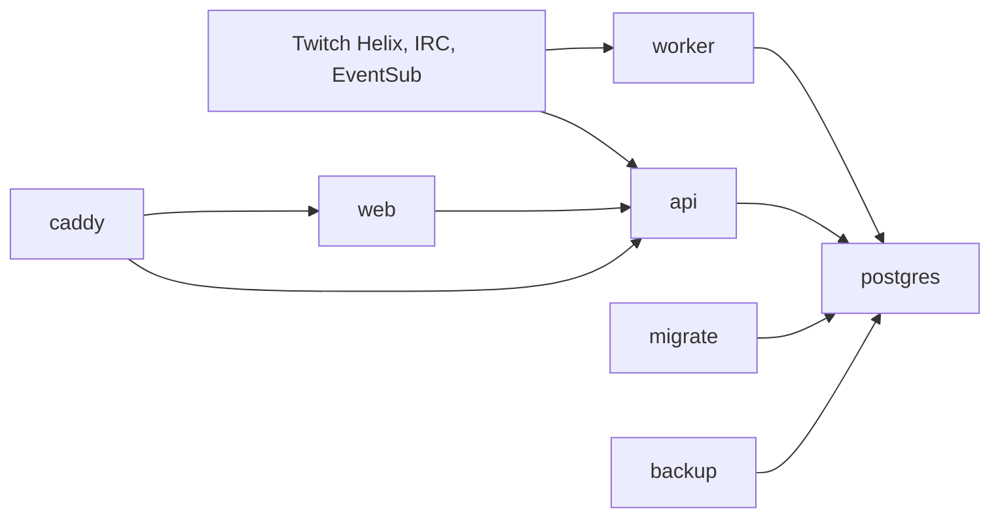

# Twitch Tracker Technical PRD

Status: draft for implementation planning, 2026-07-07.

This document defines the technical product requirements for the first private
MVP and the planned single-server production architecture. It consolidates the
accepted architecture decisions in `docs/adr/`, the glossary in `CONTEXT.md`,
and the feasibility notes in `docs/architecture-notes.md`.

## 1. Product Goal

Build a public-style analytics product for Finnish Twitch streams and channels.
The system discovers Finnish Twitch streams, tracks stream sessions and
snapshots, collects deep chat data where bot-account capacity allows, stores raw
observed Twitch data for the private MVP, and serves analytics through a web UI.

The public product promise is Channel Analytics first:

- live Finnish stream rankings
- stream and channel history
- viewer-count trends
- category, title, language, and tag history
- aggregate chat activity where available
- limited Public Chatter Summary pages

Detailed individual Chatter Data is not the main public promise. In the private
MVP, detailed Private MVP Profiles can expose raw observed chatter timelines for
development and validation. Before public launch, detailed chatter timelines and
raw message history must be gated behind an authenticated Own Data View or an
explicit admin path.

## 2. Operating Modes

The API owns access control for all modes. The frontend can hide or show UI, but
the API is the enforcement point.

`local`:

- local developer mode
- Private MVP Profiles may be visible without Twitch login
- may use mock/test Twitch credentials
- may skip EventSub webhooks if no public HTTPS callback exists

`private_mvp`:

- deployed but not public product mode
- can expose detailed Private MVP Profiles to the operator
- stores Raw Observed Data aggressively
- still uses official Twitch interfaces and respects Twitch limits

`production`:

- public product mode
- public pages show Channel Analytics and limited Public Chatter Summaries
- detailed chatter timelines and raw chat message history require Own Data View
  or admin authorization
- technical retention controls must be enabled and public privacy, deletion, and
  opt-out rules must be finalized before this mode is used publicly

## 3. Success Criteria

The first implementation is successful when it can:

- run on one machine through Docker Compose
- start PostgreSQL, API, worker, web, Caddy, migration, and backup services
- discover live `language=fi` Twitch streams through Helix REST
- persist stream sessions and periodic stream snapshots
- hydrate Twitch users/channels through Helix REST
- manage one bot account and model future multi-account capacity
- assign chat tracking to a stable priority-ranked set of live Finnish streams
- connect to Twitch IRC for assigned Chat-Tracked Streams
- persist raw IRC messages, parsed chat messages, and JOIN/PART events
- receive or at least model EventSub lifecycle and channel events
- serve public-style analytics pages from real database data
- expose internal ingestion diagnostics
- enforce Deployment Mode access rules from the API

## 4. Non-Goals

The MVP does not try to:

- identify exact stream viewers
- claim JOIN/PART equals exact viewership
- join every Twitch channel
- bypass Twitch limits with throwaway accounts
- make all observed chatter history public
- use Kubernetes
- introduce Redis, ClickHouse, TimescaleDB, Kafka, NATS, or RabbitMQ
- implement final public privacy/legal policy
- implement final Drizzle migrations before the first schema pass

## 5. Accepted Architecture Decisions

The following ADRs are accepted inputs to this PRD:

- `0001-public-product-boundary.md`
- `0002-raw-observed-data-first.md`
- `0003-all-streams-with-capacity-managed-chat-tracking.md`
- `0004-priority-based-chat-assignments.md`
- `0005-rest-irc-eventsub-ingestion-ownership.md`
- `0006-node-lts-production-runtime.md`
- `0007-raw-event-ledger-and-normalized-tables.md`
- `0008-postgresql-only-data-store.md`
- `0009-typescript-monorepo-layout.md`
- `0010-rest-api-with-zod-contracts.md`
- `0011-api-owned-authentication-and-access-control.md`
- `0012-prd-level-schema-before-migrations.md`
- `0013-public-analytics-and-ingestion-diagnostics-first.md`
- `0014-single-server-docker-compose-deployment.md`
- `0015-one-modular-worker-service.md`
- `0016-twitch-sdks-behind-adapters.md`

## 6. System Architecture



Core services:

- `caddy`: TLS termination and reverse proxy
- `web`: Next.js/React frontend
- `api`: Hono REST API, auth, sessions, access control, EventSub webhooks
- `worker`: modular ingestion and aggregation worker
- `postgres`: only database
- `migrate`: one-shot Drizzle migration runner
- `backup`: PostgreSQL backup job/container

The worker and API share database schema, config parsing, Twitch helpers, and
domain parsing through monorepo packages.

## 7. Tech Stack

Runtime and language:

- Node.js LTS for production API and worker runtime
- TypeScript everywhere
- pnpm as package manager

Backend:

- Hono for REST API
- Zod for runtime validation and contracts
- Drizzle for PostgreSQL schema/query layer
- PostgreSQL as the only data store

Twitch libraries:

- Twitch integration must live behind project-owned adapter interfaces, not be
  imported throughout product code.
- The first implementation uses native `fetch` adapters for OAuth, Helix REST,
  and EventSub management because the API surface is small and raw payload/state
  ownership matters.
- Twurple remains an acceptable future candidate behind the same adapter
  boundary if it reduces maintenance cost without weakening raw-data capture or
  reconnect/assignment control.
- Hono owns EventSub webhook receipt and signature verification.
- IRC ingestion starts with a project-owned TLS IRC socket adapter because the
  product must persist raw IRC lines and control assignment, reconnect,
  JOIN/PART, and capacity behavior directly. `@twurple/chat` can still be
  evaluated later behind the same adapter interface if it proves compatible.
- High-level bot abstractions such as `@twurple/easy-bot` are out of scope.

Frontend:

- Next.js
- React
- TanStack Query for API data fetching
- CSS approach to be chosen during implementation, favoring the repo's first
  established convention and avoiding unnecessary UI dependencies

Deployment:

- Docker Compose on one server
- Caddy for TLS and routing
- PostgreSQL volumes and backup volume/target

Not in MVP critical path:

- Bun
- GraphQL
- tRPC
- Kubernetes
- Redis
- ClickHouse
- TimescaleDB
- message brokers

## 8. Monorepo Layout

Planned repository shape:

```txt
apps/
  web/
  api/
  worker/

packages/
  db/
  config/
  twitch/
  shared/

infra/
  caddy/
  docker/

docs/
  adr/
  architecture-notes.md
  technical-prd.md
```

Package ownership:

- `packages/db`: Drizzle schema, migrations, database client helpers
- `packages/config`: Zod-validated environment and shared config
- `packages/twitch`: project-owned Twitch REST, IRC, EventSub
  adapters/clients/parsers/schemas
- `packages/shared`: shared DTOs, utility types, and domain helpers used by at
  least two apps

Rule: code used by one app stays in that app until reuse is real.

Rule: Twurple types should not become the public domain model of the app.
Adapters translate Twurple/custom-client output into project-owned raw ledger
records and normalized DTOs.

## 9. Twitch Integration Ownership

No single Twitch interface is complete. The system uses REST, IRC, and EventSub
together with explicit ownership boundaries.

### REST

REST is mandatory and acts as discovery, metadata, snapshot, and repair source.

REST owns:

- discovering all live Finnish streams
- hydrating Twitch users/channels
- recording viewer-count snapshots
- reconciling stream sessions
- detecting streams that vanished from live results
- checking bot moderated channels
- using `Get Chatters` only where authorization allows it
- reconciling EventSub subscription state
- recording Twitch rate-limit observations

Important REST constraints:

- `Get Streams` is dynamic and paginated; duplicate or missing streams can occur
  during paging.
- `language=fi` is a stream-language classification, not nationality.
- REST polling remains required even if EventSub is enabled.

### IRC

IRC owns private-MVP deep chat tracking for assigned Chat-Tracked Streams.

IRC owns:

- raw IRC lines
- chat messages
- IRC `JOIN`
- IRC `PART`
- tags
- commands
- room/user state messages when observed
- reconnect state and connection health

IRC does not own:

- exact viewer identity
- exact viewer count
- all Finnish streams if capacity exceeds available bot-account joins

### EventSub

EventSub owns lifecycle and structured channel events.

Initial target events:

- `stream.online`
- `stream.offline`
- `channel.update`
- `channel.raid`

Later target events where scopes and product value justify them:

- chat notifications
- message delete/clear events
- subs/gifts/cheers
- hype train events
- polls and predictions
- channel points events
- moderator events where authorized
- shared chat events

Production should prefer EventSub webhooks behind Caddy. Local development can
skip EventSub, use a small WebSocket test set, or use a tunnel when needed.

### Source Conflict Rule

When multiple sources can observe the same real-world event:

- define one primary source for normalized state
- store secondary evidence in the Raw Event Ledger when useful
- dedupe by Twitch IDs, event IDs, broadcaster ID, stream ID, timestamp, and
  source-specific identifiers
- use REST as the repair/reconciliation path

## 10. Bot Accounts and Chat Capacity

The product tracks all Discovered Streams at metadata/snapshot level. Chat-level
tracking is capacity-managed.

Default assumptions for one normal bot account:

- 100 concurrent non-authorized joined chat rooms
- 20 join attempts per 10 seconds
- IRC joins and EventSub chat subscriptions both count as joining chat
- broadcaster-authorized or moderator cases can have different behavior and
  must be modeled separately

The system starts with one bot account but models a future account pool.

Account pool requirements:

- each bot account has explicit enabled/disabled state
- each account has configured join capacity
- each account has join-rate limit configuration
- each account tracks current assignments
- each account tracks connection health
- each account tracks token validation/refresh state
- assignment logic can compute top `n * 100` non-authorized streams when using
  `n` normal accounts

Multiple accounts are not a license to evade Twitch limits. They must be under
operator control, use official APIs, respect rate limits, and be removable from
the pool without losing normalized product data.

## 11. Chat Assignment Policy

The assignment scheduler decides which live streams become Chat-Tracked Streams.

Inputs:

- currently live Discovered Streams
- current viewer count
- stream language
- manual pins
- channel priority
- authorization/moderator status
- bot-account capacity
- current assignments
- join/leave cooldowns
- account connection health
- recent errors
- subject tracking opt-out state

Priority order:

1. manually pinned channels
2. authorized or modded channels where deeper tracking is allowed
3. live Finnish streams by priority score, primarily viewer count
4. existing healthy assignments receive a stability bonus

Anti-churn rules:

- do not constantly rotate based on small viewer-count changes
- preserve healthy assignments unless a replacement is clearly higher priority
- use a minimum assignment age before voluntary replacement
- immediately free slots after confirmed stream end
- immediately free slots after broadcaster tracking opt-out
- immediately free slots after disqualification, repeated join failure, or
  account failure when no recovery is expected
- rate-limit joins and leaves per account

Every assignment decision must be persisted with:

- bot account
- broadcaster/channel
- stream session
- desired state
- actual state
- reason
- priority score
- timestamps
- error details if any

## 12. Worker Design

The MVP uses one worker container with modular loops.

Loops:

- `discovery`: REST `Get Streams`, stream sessions, stream snapshots
- `user-hydration`: batch `Get Users`, user metadata and name history
- `assignment`: chat capacity, priority scoring, join/leave desired state
- `irc`: IRC connections, raw lines, messages, JOIN/PART, reconnects
- `eventsub`: subscription reconciliation and webhook/event processing support
- `aggregation`: minute/hour/day buckets and derived stats
- `maintenance`: raw text/payload retention, stale assignment cleanup, token
  validation, operational housekeeping

Reliability requirements:

- each loop writes a heartbeat
- each loop writes `ingestion_runs`
- each loop has timeouts and bounded retries
- recoverable loop failures do not stop unrelated loops unnecessarily
- unrecoverable config or database failures stop the process
- graceful shutdown stops scheduling new work
- IRC shutdown should stop claiming healthy assignment state
- all Twitch calls record rate-limit observations

The worker can split into multiple services later only after measured load or
operational isolation demands it.

## 13. Database Plan

PostgreSQL is the only database. The first schema should be designed for
correctness, reprocessing, explainability, retention, and future partitioning.

Retention classes:

- `long_lived`: product state and public analytics
- `raw_private_mvp`: raw payloads and raw message text, retained aggressively in
  private MVP but redacted by configurable retention before production
- `secret`: encrypted token/session-sensitive data
- `operational`: runs, heartbeats, errors, rate-limit observations
- `aggregate`: derived stats that should survive raw retention changes

Exact Drizzle column types and indexes are implementation details, but the
following table groups are required.

### Identity Tables

`twitch_users`

- canonical row for every Twitch account observed
- key: Twitch user ID
- stores current login, display name, account type, broadcaster type,
  description, profile image, offline image, account creation timestamp,
  first/last seen timestamps, and last metadata refresh timestamp
- excludes email and deprecated `view_count`

`twitch_user_name_history`

- login/display-name history
- supports Twitch name changes
- stores observed-from, observed-until, source, and timestamps

`channels`

- tracker-specific channel state keyed by Twitch user ID
- stores first/last seen as Finnish Stream, manual pin, priority, opt-in status
  if added, known moderator/authorization status, and internal notes/tags

### Stream Tracking Tables

`stream_sessions`

- one row per Twitch stream lifecycle
- key: Twitch stream ID
- stores broadcaster, Twitch `started_at`, first seen, last seen live, ended at,
  end source/reason, language, initial/latest title, initial/latest category,
  mature flag where available

`stream_snapshots`

- periodic point-in-time stream state
- stores stream session, broadcaster, observed timestamp, viewer count, title,
  category/game, language, tags, thumbnail template, and source run/request

`stream_tags`

- optional normalized stream tag observations if JSON tags become hard to query
- can be deferred until implementation needs tag queries

### Bot and Capacity Tables

`bot_accounts`

- bot account registry
- stores Twitch user ID, login, enabled state, configured max joined rooms,
  join-rate config, priority, and health status

`bot_account_tokens`

- encrypted bot/user OAuth token material and metadata
- stores scopes, expiry, refresh status, validation timestamp, and token health
- token values must not be logged or exposed through API responses

`chat_assignments`

- desired and actual bot-to-channel assignment state
- stores bot account, broadcaster, stream session, assignment status, priority
  score, join method, joined/left timestamps, last message timestamp, last
  membership event timestamp, and latest error state

`chat_assignment_events`

- append-only history of assignment decisions and state transitions
- stores assignment, event type, reason, timestamps, and structured details

`irc_connections`

- IRC connection/session history
- stores bot account, connection status, connected/disconnected timestamps,
  last ping/pong, reconnect count, and error metadata

### Raw Event Ledger Tables

`raw_helix_responses`

- raw REST response ledger
- stores endpoint, request params, status, response JSON, pagination info,
  rate-limit headers, observed timestamp, and ingestion run
- raw request/response payload fields are redacted after the configured raw
  payload retention window while preserving operational history

`raw_irc_messages`

- raw IRC message ledger
- stores raw line, parsed command, tags JSON, channel login, bot account,
  connection ID, received timestamp, and parse status
- raw line and tags are redacted after the configured raw chat retention window

`raw_eventsub_events`

- raw EventSub event ledger
- stores Twitch message/event IDs, subscription ID, event type/version,
  payload JSON, received timestamp, processing status, and error metadata
- payload JSON is redacted after the configured raw payload retention window

`eventsub_subscriptions`

- durable EventSub subscription state
- stores Twitch subscription ID if known, event type/version, condition JSON,
  stable condition key, broadcaster, transport method, callback URL, Twitch
  status, cost, last sync timestamp, and latest reconciliation error

### Chat Tables

`chat_messages`

- normalized chat messages
- stores Twitch message ID, broadcaster, stream session if known, chatter,
  source, sent/received timestamps, message type, raw text where enabled,
  badges, emotes/fragments summary, reply parent, shared-chat source channel,
  deletion/clear state, and raw ledger reference

`chat_message_fragments`

- optional normalized fragments for text, emotes, mentions, cheermotes, and
  positions when raw message parsing needs queryable detail

`chat_membership_events`

- normalized IRC JOIN/PART observations
- stores broadcaster, chatter ID if known, chatter login, event type, event
  timestamp, received timestamp, stream session if known, connection, and raw
  ledger reference

`chat_room_state_events`

- room/user state observations such as IRC ROOMSTATE/USERSTATE where useful
- stores broadcaster, bot account, state type, payload, timestamp, and raw
  ledger reference

### Structured Channel Event Tables

`channel_events`

- generic normalized EventSub/IRC/REST-derived channel event row
- stores event type, broadcaster, stream session if known, actor user if any,
  occurred timestamp, source, source event ID, and raw reference

`raids`

- normalized raid events
- stores source broadcaster, target broadcaster, viewer count if provided,
  occurred timestamp, stream session references if known, and raw event
  reference

Future tables can be added for subs, gifts, cheers, polls, predictions, channel
points, and moderation events when product requirements and scopes justify them.

### Aggregate Tables

`stream_activity_buckets`

- per stream and time bucket
- stores viewer count summary, message count, membership event counts,
  approximate active chatter count where defensible, and event counts

`channel_daily_stats`

- per channel/day rollup
- stores stream count, live duration, viewer stats, category stats, message
  counts, and aggregate engagement

`chatter_channel_activity_buckets`

- per chatter/channel/time bucket
- stores message counts, first/last observed activity, active minutes, join/part
  counts, emote counts, and badge observations

`chatter_daily_stats`

- per chatter/day rollup
- used for Private MVP Profiles, Own Data View, and limited Public Chatter
  Summaries

Aggregates should be designed so public analytics do not require long-term raw
message text.

### Auth and Product Access Tables

`app_users`

- product user identity linked to Twitch login
- stores Twitch user ID, role flags, created timestamp, and last login

`sessions`

- server-side browser sessions
- stores session ID/hash, app user, expiry, created timestamp, last seen, and
  revocation state

`oauth_accounts`

- OAuth account metadata for logged-in users
- stores provider, provider user ID, scopes, token expiry, and encrypted token
  material only where required

`admin_users`

- explicit admin authorization list
- can be table-backed or config-seeded during MVP

`privacy_requests`

- subject privacy request ledger
- stores request type, status, subject Twitch user, requesting app user,
  reviewing app user, details, requested/resolved timestamps, and latest error
- used for public profile opt-out, tracking opt-out, and data-deletion workflow

`subject_privacy_states`

- current enforceable privacy state keyed by Twitch user ID
- stores whether public profile/chatter summaries are hidden, whether future
  broadcaster chat tracking is opted out, raw data redaction timestamp, data
  deletion timestamp, and latest request reference

`privacy_request_events`

- append-only event history for privacy requests
- stores request, event type, actor app user, details, and occurrence timestamp

### Operations Tables

`ingestion_runs`

- one row per worker loop/run
- stores job type, started/finished timestamps, status, counts, error class,
  and summary details

`job_locks`

- Postgres-backed coordination for loops that must not overlap
- useful even with one worker to avoid accidental duplicate processes

`rate_limit_observations`

- captures Twitch rate-limit headers and endpoint/account context
- powers diagnostics and adaptive scheduling

`worker_heartbeats`

- latest health for each worker loop
- powers `/internal/ingestion`

`event_processing_failures`

- failed raw-event processing records
- stores raw reference, parser/handler name, error class, retry count, and next
  retry timestamp

## 14. API Plan

The API is Hono REST/JSON with Zod validation at runtime boundaries.

Public endpoints:

- `GET /api/health`
- `GET /api/streams/live`
- `GET /api/streams/recent`
- `GET /api/streams/:streamId`
- `GET /api/streams/:streamId/activity`
- `GET /api/channels/:login`
- `GET /api/channels/:login/streams`
- `GET /api/channels/:login/viewer-history`
- `GET /api/channels/:login/activity`
- `GET /api/chatters/:login`

Stream and channel analytics endpoints are aggregate-first.
`/api/streams/live` returns current live Finnish stream summaries enriched with
the latest stored viewer-count snapshot and chat-assignment state when
available. Viewer counts come from Twitch REST snapshots; chat assignment or
JOIN/PART state must not be presented as exact viewership.
`/api/streams/:streamId/activity` returns bounded viewer snapshots, activity
buckets, channel events, raids, and totals. Channel `viewer-history` returns
bounded recent viewer snapshots from `stream_snapshots`. Channel `activity`
returns daily stats, recent stream activity buckets, and aggregate totals from
PostgreSQL rollup tables.

Authenticated endpoints:

- `GET /api/me`
- `GET /api/me/data`
- `GET /api/me/privacy`
- `POST /api/me/privacy/requests`
- `GET /api/auth/twitch/start`
- `GET /api/auth/twitch/callback`
- `POST /api/auth/logout`

Private/admin/internal endpoints:

- `GET /api/internal/ingestion`
- `GET /api/internal/messages`
- `GET /api/internal/bot-accounts`
- `GET /api/internal/chat-assignments`
- `GET /api/internal/rate-limits`
- `GET /api/internal/privacy-requests`
- `POST /api/internal/privacy-requests/:requestId/complete`
- `GET /api/internal/errors`
- `GET /api/private/chatters/:login`
- `GET /api/private/streams/:streamId/raw`

The private chatter endpoint may return bounded recent message and JOIN/PART
timelines for local/private MVP validation. The private stream raw endpoint may
return bounded raw-linked chat, membership, and EventSub-derived rows for a
specific stream. These are not public analytics endpoints.

Webhook endpoints:

- `POST /api/webhooks/twitch/eventsub`

Access rules:

- public analytics endpoints return only public-safe data
- private endpoints require `local`/`private_mvp` mode or admin authorization
- admin authorization can come from the product user role or the explicit
  `admin_users` table
- Own Data View requires logged-in Twitch identity matching the requested user
- Own Data privacy controls let the subject hide public chatter/profile
  summaries, opt out of future chat tracking as a broadcaster, and record a
  data-deletion request
- completing a data-deletion request redacts subject-linked raw message content,
  chat identity links, raw IRC/EventSub payload references, and subject
  aggregate rows while preserving operational audit history
- internal diagnostics require local/private/admin access
- API responses never include OAuth token values, secrets, raw session values,
  or full config

## 15. Frontend Plan

The first UI is the actual analytics product, not a landing page.

Pages:

- `/`: live Finnish streams, rankings, tracked-chat indicator, recent starts
- `/channels/[login]`: channel profile, live state, stream history, charts,
  category/title/language history, aggregate chat activity
- `/streams/[streamId]`: stream session timeline, viewer snapshots, chat volume,
  raids/events, private raw/detail sections when allowed
- `/chatters/[login]`: Private MVP Profile in local/private modes, limited
  Public Chatter Summary in production unless subject-authenticated
- `/me`: Own Data View after Twitch login
- `/internal/ingestion`: worker status, bot accounts, chat assignments, rate
  limits, recent errors
- `/internal/messages`: paginated captured-message archive with chatter,
  channel, and stream context for admins

Frontend requirements:

- use server-rendered API reads for first-load analytics pages
- use TanStack Query for client-side freshness, filters, polling, and
  interactive panels when those views need browser-managed server state
- keep access checks backed by API responses
- design for dense analytics, not marketing copy
- show data coverage honestly, especially when a stream is Discovered but not
  Chat-Tracked
- distinguish viewer count, chat activity, and chat presence clearly

## 16. Auth and Access Control

The API owns auth.

Requirements:

- Twitch OAuth through server-side authorization-code flow
- validate OAuth state on callback
- use secure HTTP-only cookies for browser sessions
- keep product sessions separate from Twitch API tokens
- validate and refresh Twitch tokens when needed
- store token values encrypted if persistence is required
- never expose token values to browser JavaScript
- never log secrets, tokens, refresh tokens, session cookies, or `.env` values

Production access:

- public pages show Channel Analytics and limited Public Chatter Summaries
- Own Data View is subject-authenticated
- admin access is explicit
- private-MVP shortcuts are disabled

## 17. Docker Compose Plan

Initial services:

`caddy`:

- listens on public HTTP/HTTPS
- handles TLS
- proxies `/` to `web`
- proxies `/api/*` and webhook paths to `api`

`web`:

- Next.js server
- talks to API through internal/public URL config

`api`:

- Hono server
- REST API
- Twitch OAuth/session handling
- EventSub webhook receiver

`worker`:

- modular ingestion worker
- connects to Twitch REST/IRC/EventSub
- writes PostgreSQL

`postgres`:

- only database
- persistent volume

`migrate`:

- one-shot Drizzle migrations
- should be safe to run before app start/deploy

`backup`:

- scheduled `pg_dump` or equivalent
- local backup volume first
- off-server target before serious production use

## 18. Configuration

All config is Zod-validated at process startup.

Required config categories:

- `APP_MODE`
- public URLs
- API URLs
- database URL
- session cookie settings
- session secret/encryption keys
- Twitch client ID/secret
- Twitch OAuth redirect URI
- EventSub webhook secret
- bot account credentials/tokens or token references
- join capacity defaults
- join rate-limit defaults
- polling intervals
- retention settings
- stale assignment grace window
- backup settings

Invalid config should fail fast at startup.

## 19. Observability and Operations

Minimum observability:

- structured logs
- worker heartbeats
- ingestion run records
- rate-limit observations
- current chat assignments
- bot account health
- EventSub subscription state
- raw-event processing failures
- backup success/failure records

Internal diagnostics page must answer:

- is discovery running?
- when did each loop last succeed?
- how many streams are live/discovered?
- how many streams are Chat-Tracked?
- which accounts are at capacity?
- what was joined or left recently, and why?
- are Twitch rate limits healthy?
- which raw events failed to parse?
- are backups recent?

## 20. Testing Strategy

Unit tests:

- Zod config parsing
- Twitch REST response parsers
- IRC line parser
- EventSub payload validation
- stream-session reconciliation
- chat assignment scoring and anti-churn rules
- access-control decisions

Integration tests:

- Drizzle schema/migration smoke checks
- database upsert paths
- raw-event-to-normalized processing
- worker loop with mocked Twitch clients
- API route validation and access behavior

End-to-end checks:

- local Compose starts
- API health works
- web can render live streams from seeded data
- private mode exposes Private MVP Profile
- production mode blocks detailed chatter access without auth

Manual private-MVP checks:

- `corepack pnpm smoke:twitch -- --require-live` passes with real Twitch
  credentials before claiming Twitch ingestion has been verified
- one bot account can connect to IRC
- assigned channels are joined within rate limits
- JOIN/PART and messages are stored
- ended streams free assignments
- reconnect preserves or reconciles assignments safely
- `corepack pnpm smoke:twitch -- --require-live --eventsub-callback` passes
  before claiming production EventSub callback readiness

## 21. Implementation Phases

Phase 0: project scaffold

- pnpm monorepo
- apps/packages layout
- shared TypeScript config
- lint/typecheck/test tooling
- Docker Compose skeleton
- Twitch adapter interfaces and dependency spike plan

Phase 1: database and config

- PostgreSQL Compose service
- Drizzle setup
- initial schema for identity, streams, raw ledgers, assignments, operations
- Zod config package
- migration runner

Phase 2: REST discovery

- Twitch Helix client behind adapter boundary
- `Get Streams` polling
- stream session reconciliation
- stream snapshots
- user hydration
- ingestion runs and rate-limit observations
- raw REST response and rate-limit header capture

Phase 3: API and web analytics baseline

- Hono API
- live streams endpoint with latest viewer snapshot and chat-assignment state
- channel endpoint
- Next.js pages for live streams and channel profile
- TanStack Query integration

Phase 4: chat assignment and IRC ingestion

- bot account model
- priority assignment scheduler
- IRC connection manager
- project-owned IRC socket adapter
- raw IRC storage
- parsed messages and JOIN/PART events
- internal ingestion diagnostics

Phase 5: EventSub

- webhook receiver
- signature/secret validation where required by Twitch flow
- Hono-owned webhook receipt
- subscription reconciliation
- stream lifecycle and raid/channel update events
- raw and normalized event storage

Phase 6: auth and access modes

- Twitch login
- API-owned sessions
- Deployment Mode gates
- Own Data View
- production-mode restrictions for chatter detail

Phase 7: hardening

- backup container
- baseline raw retention jobs
- Twitch credential smoke runbook
- partitioning review for high-volume tables
- diagnostics polish
- public launch privacy/legal checklist

## 22. Public Launch Gates

Before production public launch:

- run live Twitch smoke checks with production-like credentials
- confirm raw chat retention period and defaults
- confirm raw payload retention period and defaults
- confirm deletion/opt-out policy, response times, and operator procedure
- review public Chatter Summary scope
- verify Own Data View access control
- verify admin access control
- verify privacy request completion flow on production-like data
- verify no secrets in logs/API responses
- verify Twitch Developer Agreement obligations
- verify GDPR/privacy obligations for identifiable or pseudonymous data
- verify backup/restore process
- verify production Caddy/TLS/EventSub webhook behavior

## 23. Open Questions

These do not block the first implementation PRD, but they must be resolved
before public launch or before expanding ingestion scale:

- How many bot accounts will be used in the first private MVP?
- Will any streamers explicitly authorize or mod the bot early?
- Are the default raw chat and raw payload retention periods acceptable for
  public launch, or should production use shorter windows?
- What public Chatter Summary fields are acceptable in production?
- What public copy and operator SLA should be used for data-deletion requests?
- What off-server backup target will be used?
- Should EventSub start in private MVP or after REST + IRC baseline?
- Should `Get Chatters` snapshots be enabled only for modded/authorized channels
  once scopes are confirmed?
- Will streamer opt-in become a first-class product concept?

## 24. Source Links

- Twitch Chat and chatbot limits:
  https://dev.twitch.tv/docs/chat/
- Twitch IRC capabilities:
  https://dev.twitch.tv/docs/chat/irc/
- EventSub subscription types:
  https://dev.twitch.tv/docs/eventsub/eventsub-subscription-types/
- EventSub WebSocket behavior and limits:
  https://dev.twitch.tv/docs/eventsub/handling-websocket-events/
- EventSub subscription management:
  https://dev.twitch.tv/docs/eventsub/manage-subscriptions/
- Twitch API reference:
  https://dev.twitch.tv/docs/api/reference/
- Twitch API rate limits:
  https://dev.twitch.tv/docs/api/guide/#twitch-rate-limits
- Twitch authentication:
  https://dev.twitch.tv/docs/authentication/
- Twitch OAuth token flow:
  https://dev.twitch.tv/docs/authentication/getting-tokens-oauth/
- Twitch refresh tokens:
  https://dev.twitch.tv/docs/authentication/refresh-tokens/
- Twitch token validation:
  https://dev.twitch.tv/docs/authentication/validate-tokens/
- Twitch Developer Agreement:
  https://legal.twitch.com/en/legal/developer-agreement/
- Twurple:
  https://twurple.js.org/
- Twurple GitHub:
  https://github.com/twurple/twurple
